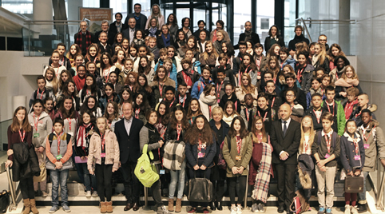

## Pour une citoyenneté active des jeunes

Parce que vivre au collège, c’est déjà vivre en société, les Conseillers départementaux Jeunes représentent leur collège et s’initient au travail collectif et à la vie publique. Chaque année, ils proposent de nouvelles idées et réalisent de nouvelles actions.

Le CDJ est un formidable outil de rassemblement des collégiens et d’apprentissage de la citoyenneté, une forme d’éducation civique appliquée à la réalité, qui se traduit par des actions concrètes, susceptibles d’améliorer la vie quotidienne des collégiens girondins.

## Le Conseil Départemental des Jeunes (CDJ), qu’est-ce que c’est ?

En Gironde, l’apprentissage de la citoyenneté passe notamment par le Conseil Départemental des Jeunes. Vivre au collège, c’est déjà vivre en société. Les Conseillers départementaux jeunes représentent TOUS LES COLLÈGES DE GIRONDE et s’initient au travail collectif et à la vie publique. Le Conseil Départemental des Jeunes est un lieu de consultation des jeunes girondins. Les jeunes élus sont des ambassadeurs de leur génération.

## Son rôle

Le Conseil Départemental des Jeunes permet aux collégiens girondins d’exercer leurs droits et leurs devoirs de citoyens en devenir par la réalisation d’actions concrètes.
C’est un lieu de réflexion, de discussion et d’action, de découverte et d’apprentissage de la vie civique et de la démocratie locale.

## Candidater

[C'est par là !](./electionCDJ.html)

## Commissions

Les conseillers départementaux du Conseil départemental des Jeunes de Gironde, élus pour un mandat d'un an se répartissent en commissions pour travailler sur des projets dont ils sont à l'initiative.

## Fonctionnement

Lors de la séance inaugurale, les collégiens se répartissent au sein des différentes commissions proposées et élaborent ensemble leur projet pour l'année en compagnie d'animateurs issus de l'éducation nationale ou du Conseil départemental de la Gironde

Vous pouvez découvrir les comptes-rendus des travaux de l'année 2016 de chacune des 6 commissions : 

* [sport et santé](sports-sante/)
* [environnement](environnement-developpementDurable/)
* [solidarité](solidarite/)
* [arts et culture](art-culture-citoyennete/)
* [médias et usages numériques](media-usages-numerique/)

Vous pouvez également consulter les archives des travaux de chacune de ces commissions :

* [sport et santé](sports-sante/archives/)
* [environnement](environnement-developpementDurable/archives/)
* [solidarité](solidarite/archives/)
* [arts et culture](art-culture-citoyennete/archives/)
* [médias et usages numériques](media-usages-numerique/archives/)