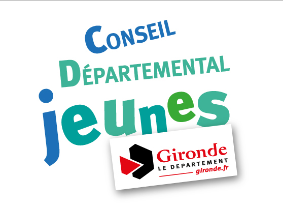

Le Conseil Départemental des Jeunes (CDJ), qu’est-ce que c’est ?
En Gironde, l’apprentissage de la citoyenneté passe notamment par le Conseil Départemental des Jeunes. Vivre au collège, c’est déjà vivre en société. Les Conseillers départementaux jeunes représentent TOUS LES COLLÈGES DE GIRONDE et s’initient au travail collectif et à la vie publique. Le Conseil Départemental des Jeunes est un lieu de consultation des jeunes girondins. Les jeunes élus sont des ambassadeurs de leur génération.

## Son rôle

Le Conseil Départemental des Jeunes permet aux collégiens girondins d’exercer leurs droits et leurs devoirs de citoyens en devenir par la réalisation d’actions concrètes.
C’est un lieu de réflexion, de discussion et d’action, de découverte et d’apprentissage de la vie civique et de la démocratie locale.

## Comment être candidat ?

Tu dois être en classe de 5e ou de 4e. Un seul Conseiller départemental jeune est élu par collège pour un an.
Tu informes de ta candidature avec la Déclaration de candidature, qui sera affichée dans ton collège.
Pour la remplir, tu choisis le domaine qui t’intéresse dans la liste
ci-dessous et explique en quelques lignes ton projet :

* Solidarités et lutte contre les discriminations
* Citoyenneté européenne et relations internationales
* Sports et Santé
* Médias et usages numériques
* Environnement et développement durable
* Culture et Jeunesses

Pour t’aider dans ta campagne électorale, un adulte référent du collège t’accompagne.
Il le fera durant tout l’exercice de ton mandat, pour rendre compte régulièrement à tes camarades du travail réalisé au sein du Conseil Départemental des Jeunes.

<a href="../documents/livret_CDJ-DER.pdf">le livret</a>
 
<h2>Elections</h2>
<h2>Mandat</h2>
<h2>Commissions</h2>

Les conseillers départementaux du Conseil départemental des Jeunes de Gironde, élus pour un mandat d'un an se répartissent en commissions pour travailler sur des projets dont ils sont à l'initiative.

<h2>Fonctionnement</h2>

Lors de la séance inaugurale, les collégiens se répartissent au sein des différentes commissions proposées et élaborent ensemble leur projet pour l'année en compagnie d'animateurs issus de l'éducation nationale ou du Conseil départemental de la Gironde

Vous pouvez découvrir les comptes-rendus des travaux de l'année 2016 de chacune des 6 commissions : 
<ul>
<li>environnement</li>
<li>sport et santé</li>
<li>solidarité</li>
<li>arts et culture</li>
<li>médias et usages numériques</li>
</ul>

Vous pouvez également consulter les archives des travaux de chacune de ces commissions :
<ul>
	<li><a href="environnement-developpementDurable/archives/index.html">environnement</a></li>
	<li><a href="sports-sante/archives/index.html">sport et santé</a></li>
	<li><a href="solidarite/archives/index.html">solidarité</a></li>
	<li><a href="art-culture-citoyennete/archives/index.html">arts et culture</a></li>
	<li><a href="media-usages-numerique/archives/index.html">médias et usages numériques</a></li>
</ul>
