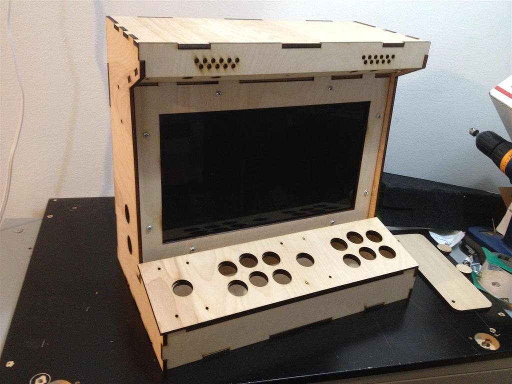

## Un boitier par des collégiens pour des collégiens

 

Le projet CollegeBox vise à fournir dans les collèges des informations au sujet de la vie du collège (menu de la cantine, professeurs absents, plan de déplacement, etc...) mais également sur le rôle de conseiller départemental des jeunes.
Les membres de la commission médias et usages numériques ont imaginé différents contenus qui pourraient être utiles aux nouveaux ciollégiens comme à leur camarades. ils ont également souhaité témoigné de leur expérience et donner envie à d'autres collégiens de les imiter.
Pour réaliser ce dispositif numérique 3 composants ont été identifié : 
- un dispositif numérique muni d'un écran et connecté au réseau Internet
- un site internet facile à mettre à jour de manière collaborative
- un boitier protégeant le dispositif numérique

### le dispositif numérique

Dans sa première version le dispositif numérique est une simple tablette équipée d'un haut-parleur, d'un écran tactile et d'un système d'exploitation android.
Si le projet se poursuit, il sera certainement intéressant de concevoir un véritable dispositif numérique dédié permettant notamment de déporter les commandes interactives.

## le site Internet

La conception du site Internet a été réfléchie avec les collégiens qui souhaitaient notamment pouvoir mettre à disposition de leurs camarades des informations pratiques sur la vie du collège.
Pour cela, @dbruant qui a accompagné les membres de la commission pendant 2 séances de travail a proposé de travailler à partir d'un générateur de pages html (Jekyll) qui fonctionne à partir de pages mises en forme à partir d'une syntaxe de mise en forme tr!ès simple : markdown.
Grâce à l'utilisation de cette syntaxe, les fichiers déposés sur l'outil de gestion de code informatique Github, peuvent êter très simplement mis à jour sans aucune connaissance du code informatique.

De plus, grâce à l'utilisation de l'outil en ligne prose.io il est possible de visualiser le contenu du fichier en markdown et de disposer de quelques outils de mise en page qui simplifient encore plus la contribution.

## le boitier

Conçu au départ avec une découpeuse laser, le boîtier qui enserre la tablette a été réalisé avec une fraiseuse numérique en prenant en compte dans la réflexion les futures contraintes permettant d'envisager son déploiement dans les collèges.

 

La première version du boîtier a été réalisée dans le fablab de Cap Sciences, le 127°.
Il a été réalisé à partir d'un outil de dessin vectoriel et d'une découpaeuse laser.
les collégiens ont ensuite assemblé les différentes pièces et intégré la tablette à l'intérieur.

En réalisant ce prototype, il sont pu prendre conscience de certaines difficultés liées aux contraintes de l'objet.

Dans un second temps, la forme du boîtier a donc été repensée pour pouvoir être plus solide et donner un accès simple à l'écran tactile tout en permettant facilement d'être relié au chargeur externe. 
Le calcul des dimensions a également du prendre en compte la nécessité d'accéder à la tablette pour la mettre à jour, insérer une carte SD et laisser une ventilation pour le son et la musique. Il a également paru pertinent de maintenir un accès à la caméra frontale.
 
La conception du boîtier a été réalisée avec le logiciel  aspire avec deux blocs découpés dans des planches de peuplier de 18 mm d'épaisseur.

 

## Le film

Un film a été réalisé avec l'équipe vidéo du service de la communication interne du Département de la Gironde a partir d'un scenario imaginé par les collégiens de la commission médias et usages numériques pour témoigner de leur expérience et donner envie à d'autres collégiens de vivre une expérience similaire. 
Il se déroule dans le fablab de cap sciences et au foyer rural des Eglisottes.

<iframe src="https://player.vimeo.com/video/167752731" width="640" height="360" frameborder="0" webkitallowfullscreen mozallowfullscreen allowfullscreen></iframe> 
<a href="https://vimeo.com/167752731">CDJ2016m&eacute;dias_num&eacute;riques version tablette</a> from <a href="https://vimeo.com/user866388">keronos</a> on <a href="https://vimeo.com">Vimeo</a>.

## Remerciements

Merci à Adeline Bourgeois pour son enthousiasme et son énergie, à Clément et Maud pour la qualité de leur accueil au fablab, à Laurent Domenech pour la réalisation du boitier, à Anne Briant, Rémi Lamouret et Roberto pour la prise de vue et le montage vidéo et aux animateurs de la commission.

