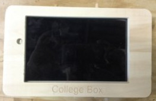

## Un boitier par des collégiens pour des collégiens

Le projet CollegeBox vise à fournir dans les collèges des informations au sujet de la vie du collège (menu de la cantine, professeurs absents, plan de déplacement, etc...) mais également sur le rôle de conseiller départemental des jeunes.
Les membres de la commission médias et usages numériques ont imaginé différents contenus qui pourraient être utiles aux nouveaux ciollégiens comme à leur camarades. ils ont également souhaité témoigné de leur expérience et donner envie à d'autres collégiens de les imiter.
Pour réaliser ce dispositif numérique 3 composants ont été identifié : 
- un dispositif numérique muni d'un écran et connecté au réseau Internet
- un site internet facile à mettre à jour de manière collaborative
- un boitier protégeant le dispositif numérique

### le dispositif numérique

Dans sa première version le dispositif numérique est une simple tablette équipée d'un haut-parleur, d'un écran tactile et d'un système d'exploitation android.
Si le projet se poursuit, il sera certainement intéressant de concevoir un véritable dispositif numérique dédié 
## le boitier

 Conçu au départ avec une découpeuse laser, le boîtier qui enserre la tablette a été réalisé avec une fraiseuse numérique en prenant en compte dans la réflexion les futures contraintes permettant d'envisager son déploiement dans les collèges
Le calcul des dimensions a donc du prendre en compte la nécessité d'accéder à la tablette pour la mettre à jour, insérer une carte SD
hauteur de 46mm
logiciel aspire
découpe intérieure face avant 170,1 x 107
 

## Le film

<iframe src="https://player.vimeo.com/video/167752731" width="640" height="360" frameborder="0" webkitallowfullscreen mozallowfullscreen allowfullscreen></iframe> 
<a href="https://vimeo.com/167752731">CDJ2016m&eacute;dias_num&eacute;riques version tablette</a> from <a href="https://vimeo.com/user866388">keronos</a> on <a href="https://vimeo.com">Vimeo</a>.

## Making-off de la College Box

[Plans de la CollegeBox (mauvais lien)](https://github.com/CGJ33/contenu-college-box)
